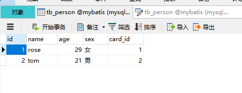
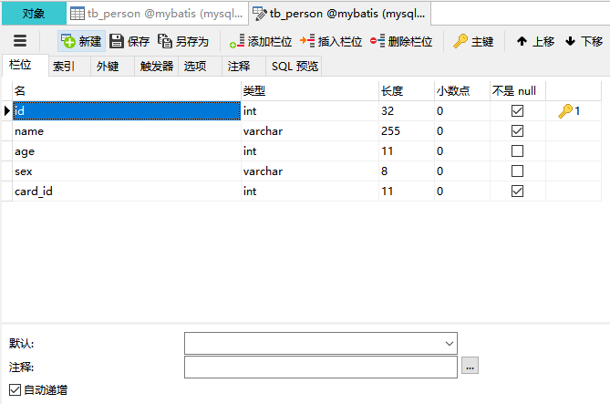
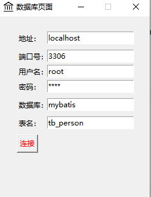
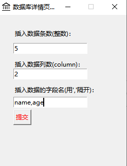
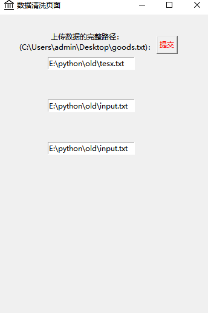

# 前述

- 开发工具：pycharm
- 语言：python
- 运行：双击exe文件
- 库：pymysql、time、tkinter


## 开发

- 创建一个数据库登录页面

- 连接远程数据库

- 进行数据清洗

  - 数据类型(目前只支持**文本**，数据为**字符串**类型，**长度不能超过数据库的提供的长度**)：

    - <font color="red">没有对字段名的类型进行验证</font>

    - 文件类型(路径：C:\Users\admin\Desktop\goods.txt)

      - 以**'\n'**结尾(单独一行)

        - ```markdown
          # 字符串类型
          "https://imgages/1/10176.jpg",
          "https://imgages/2/10313.jpg",
          "https://imgages/3/10481.jpg",
          "https://imgages/4/10256.jpg",
          "https://imgages/5/10589.jpg",
          "https://imgages/6/10325.jpg",
          "https://imgages/7/10654.jpg",
          "https://imgages/9/13052.jpg"
          ```

        - ```markdown
          # 数值类型
          225.55
          335.66
          44.4
          55.6
          330.3
          56.5
          ```

    - 数值类型:

      - 默认从1开始
      - id设置自增（无需进行插入操作）

- 进行数据库插入操作











- 记得刷新数据库，如果数据量太大，需要等待一下。
